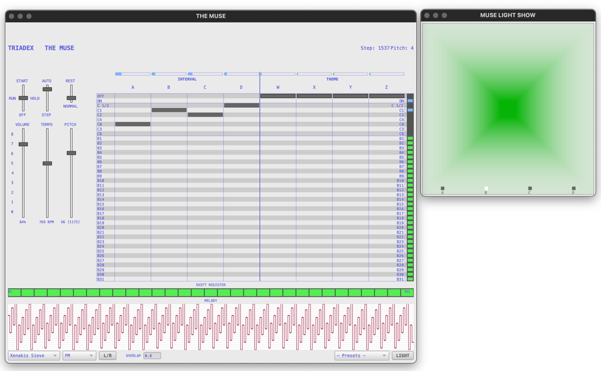
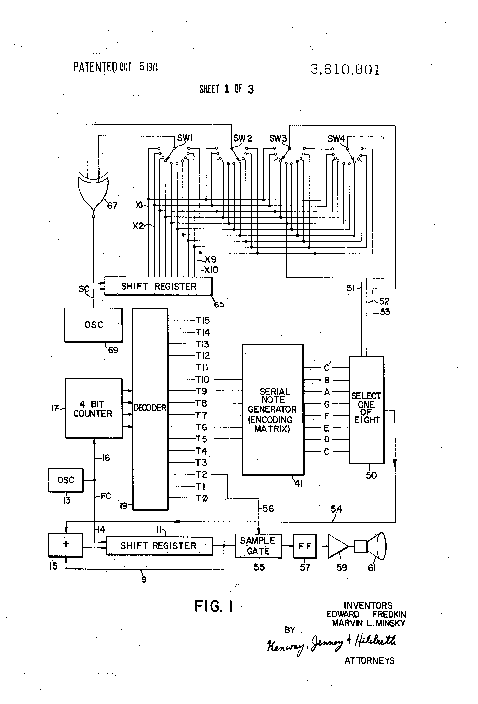
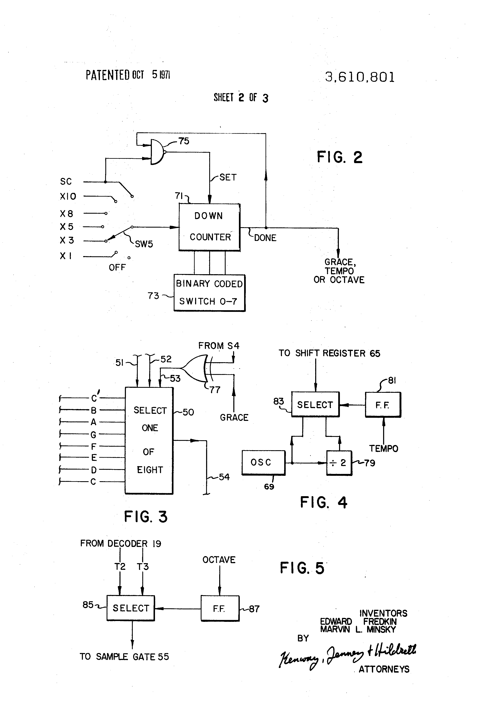
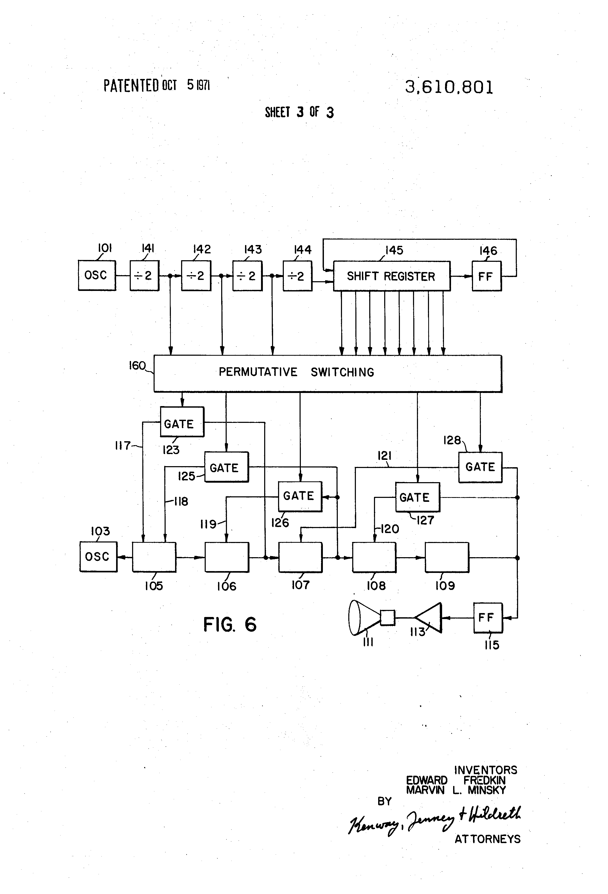

# TriadexMuse



A SuperCollider implementation of the **Triadex Muse** (Edward Fredkin and
Marvin Minsky, MIT, 1969/1972) -- a deterministic algorithmic music composer
built from binary counters, a 31-bit linear feedback shift register, and an
XNOR gate.

The original Muse had no memory of pitch or rhythm in any musical sense.
Melodies emerge from the combinatorics of eight slider positions reading
from forty binary sources. The machine is fully deterministic: the same
slider configuration always produces the same sequence.

Reference: J. Donald Tillman's JavaScript emulation and writeup,
<https://till.com/articles/muse/>.

## Research process

This implementation grew out of a study of how the Muse actually produces its
sequences. The documentation is thin and scattered, so the reconstruction read
several sources against one another.

The primary source was the original patent, US 3,610,801 (Fredkin and Minsky),
whose logic diagrams describe the counter chain, the 31-bit shift register, and
the XNOR feedback path at the gate level. Three of its drawing pages are
reproduced in `docs/img/`. I read the patent alongside the Triadex Muse
operating manual, which lays out the slider panel, the forty sources, and the
factory preset settings but says nothing about the internal logic, together with
the other accounts of the machine still in circulation, including the SDIY
discussion thread archived in `docs/`.

Where the patent and manual were silent or ambiguous, I worked from J. Donald
Tillman's JavaScript emulation and writeup, the most careful public account of
the machine's behaviour and the source of the twenty presets transcribed here.
Running the patent logic against Tillman's emulation settled the remaining
questions about clock division, edge timing, and the exact feedback tap.

Reimplementing the logic in SuperCollider was itself part of the analysis. A
cycle-accurate model is a hypothesis about the hardware, testable by comparing
its output against recordings of the original and against Tillman's emulator.
The engine in `Classes/TriadexMuse.sc` is the result, kept separate from audio
and GUI so the bare sequencing logic can be read on its own.

A longer study of the sequencing algorithm and the combinatorics behind the
slider system is on my website:
<https://www.marcinpietruszewski.com/research-triadex>.

### Source diagrams

Logic diagrams from the original patent, US 3,610,801 (Fredkin and Minsky):







An annotated diagram of the sequencing logic worked out during the study:


## Features

- **Faithful engine**: cycle-accurate reproduction of the original logic
  (5-bit counter, divide-by-3 counter, 31-bit shift register, XNOR feedback).
- **Twenty factory presets** transcribed from Tillman's emulation.
- **Seven synthesis types**: faithful square wave, sine, saw, 2-op FM,
  Karplus-Strong pluck, DPOAE, and an enhanced mode with selectable waveform,
  resonant filter, reverb, and delay.
- **Synced instances**: multiple Muses sharing a single clock, reproducing
  the original hardware sync output for interlocking sequences.
- **Thirty-three scale presets**: 12-TET diatonic and non-diatonic modes,
  microtonal (EDOs, Bohlen-Pierce, Carlos Alpha/Beta/Gamma), just intonation,
  and historical tunings (Fokker, Partch, Young, Wilson, Xenakis).
- **GUI application** with slider view, source-state display, shift register
  visualisation, and live parameter control.
- **Headless API** for use in compositions, patterns, and data analysis.

## Requirements

- SuperCollider 3.12 or later
- A working audio output

## Installation

1. Copy or symlink the `Classes` folder into your SuperCollider
   Extensions directory. You can find it by evaluating:

   ```supercollider
   Platform.userExtensionDir;
   ```

   On macOS this is typically
   `~/Library/Application Support/SuperCollider/Extensions/`.

2. Recompile the class library:
   **Language > Recompile Class Library** (Cmd/Ctrl + Shift + L).

3. Open `startup.scd` and evaluate the blocks in order.

## Quick start

```supercollider
s.boot;
TriadexMuseApplication.run;
```

Launch with a preset:

```supercollider
TriadexMuseApplication.run(preset: "Polka");
TriadexMuseApplication.run(\enhanced, "Michaels Tune");
```

Synced instances (shared clock):

```supercollider
TriadexMuseApplication.run(\faithful, "Musers Waltz", tempo: 4);
TriadexMuseApplication.runSynced(\faithful, "Birds 1", baseNote: 72, beatOffset: 0);
TriadexMuseApplication.runSynced(\enhanced, "Polka", baseNote: 48, beatOffset: 2);
TriadexMuseApplication.sharedTempo_(6);
```

Headless use inside a `Pbind`:

```supercollider
(
~muse = TriadexMuse.new;
~muse.preset_("Meditation");

Pbind(
    \instrument, \default,
    \midinote, Pfunc({ (~muse.step ? Rest()) + 60 }),
    \dur, 0.25,
    \amp, 0.1,
    \legato, 0.8
).play;
)
```

## Project layout

```
TriadexMuse/
├── README.md                       this file
├── startup.scd                     boot + launch script with synced examples
├── Classes/
│   ├── TriadexMuse.sc              algorithmic engine (no audio)
│   ├── TriadexMusePlayer.sc        audio playback and scheduling
│   ├── TriadexMuseGUI.sc           visual interface
│   ├── TriadexMuseApplication.sc   singleton launcher + sync management
│   └── TriadexMuse_StartUp.scd     complete API reference
├── examples/
│   ├── overview.scd                all examples in one file
│   └── analysis.scd                reverse-engineer recordings of the hardware
├── sounds/                         place audio recordings here for analysis
└── HelpSource/
```

## Architecture

The implementation is layered so that each level can be used independently:

| Class | Role |
|---|---|
| `TriadexMuse` | Pure algorithmic engine. No audio, no GUI. Steps produce float pitches (semitones from root) or `nil` for rests. |
| `TriadexMusePlayer` | Wraps the engine with SynthDefs, a scheduling clock, and live parameter control. |
| `TriadexMuseGUI` | Visual interface showing sliders, source states, shift register, and transport. |
| `TriadexMuseApplication` | Singleton launcher. Boots server, builds engine + player + GUI, manages lifecycle and clock sync. |

### Source table (40 positions)

```
 0       OFF      always 0
 1       ON       always 1
 2       C 1/2    counter bit 0  (clock / 2)
 3       C1       counter bit 1  (clock / 4)
 4       C2       counter bit 2  (clock / 8)
 5       C4       counter bit 3  (clock / 16)
 6       C8       counter bit 4  (clock / 32)
 7       C3       divide-by-6 counter bit 2 (clock / 6)
 8       C6       divide-by-6 counter bit 3 (clock / 12)
 9-39    B1-B31   shift register bits 1-31
```

Interval sliders **A B C D** form a 4-bit note value: `A B C` index an 8-note
scale, `D` adds the interval of equivalence (the last scale value -- 12.0
for octave-repeating scales, 19.02 for Bohlen-Pierce, etc.). Theme sliders
**W X Y Z** are XNORed together and the result is shifted into B1 on the
falling edge of the clock.

## Composition presets

Twenty preset slider configurations transcribed from Tillman's emulation.
Each preset defines interval sliders (A-D), theme sliders (W-Z), and rest
behaviour (NORM = notes on every step, REST = rests from theme logic).

| Preset | Interval (A B C D) | Theme (W X Y Z) | Rest |
|---|---|---|---|
| Als Surprise | B1 B5 B7 C1/2 | C8 B1 B7 B11 | NORM |
| Birds 1 | B1 B2 B3 C4 | B30 B31 B31 B31 | NORM |
| Birds 2 | B28 B29 B30 B30 | B30 B31 B31 B31 | NORM |
| Christmas Bells | B31 B30 B29 B28 | B28 B29 B30 B31 | NORM |
| Dorian Muse | ON B1 B3 C8 | B1 B16 OFF OFF | NORM |
| Eds Rhythm Piece | B6 B6 B6 C2 | OFF OFF B1 B31 | NORM |
| Federal Row | B14 B5 B12 B2 | B21 B24 C2 OFF | NORM |
| Flat Baroque | C1 B15 B1 C1/2 | B30 B29 B24 OFF | REST |
| Marvins Yodel | B2 B17 B9 B25 | B16 OFF B15 C1 | REST |
| Meditation | B1 B31 B14 OFF | OFF OFF B16 B31 | NORM |
| Mesopotamia | C2 B5 B9 OFF | C8 B9 B24 C4 | NORM |
| Michaels Tune | B7 B8 B5 OFF | OFF B4 B23 OFF | NORM |
| Musers Waltz | B10 B8 B7 OFF | ON C4 B1 B2 | NORM |
| Polka | B1 B13 B11 C1/2 | C8 B11 B7 B1 | REST |
| Rhyming Couplets | B1 B2 C4 C8 | OFF OFF B31 C4 | NORM |
| Rons Rhapsody | B6 B9 B6 C1/2 | B31 C4 OFF C8 | REST |
| Scale | C1 C2 C4 OFF | OFF OFF OFF OFF | NORM |
| Swiss Yodeler | B8 C1 B16 OFF | B22 B21 B16 OFF | NORM |
| The Crazy Cuckoo | C1 B1 B31 C8 | OFF OFF B1 B31 | NORM |
| Yodle | C8 B2 B5 B6 | OFF OFF B1 B31 | NORM |

```supercollider
TriadexMuse.presetNames;   // list all
muse.preset_("Polka");     // load one
```

## Synthesis types

| Type | Description |
|---|---|
| `\faithful` | Band-limited square wave matching the original hardware (default) |
| `\sine` | Clean sine tone |
| `\saw` | Sawtooth wave |
| `\fm` | 2-operator FM synthesis |
| `\pluck` | Karplus-Strong plucked string |
| `\dpoae` | Distortion product otoacoustic emission model |
| `\enhanced` | Selectable waveform + resonant filter + reverb + delay |

```supercollider
player.synthType_(\fm);
player.synthType_(\pluck);
```

## Scale presets

Thirty-three scale mappings available via `TriadexMuse.scalePreset_`. Each
maps the Muse's 3-bit note output (0-7) to semitone intervals as floats,
preserving microtonal precision. The default is major:
`[0, 2, 4, 5, 7, 9, 11, 12]`. The last value is the interval of equivalence
used by the octave bit (D slider): 12.0 for standard tunings, 19.02 for
Bohlen-Pierce, or any arbitrary interval for non-octave-repeating scales
(Carlos Alpha/Beta/Gamma). Scala `.scl` files are loaded with full cent
precision.

### 12-TET diatonic

Major, Natural Minor, Dorian, Phrygian, Lydian, Mixolydian, Harmonic Minor,
Locrian.

### 12-TET non-diatonic

Pentatonic, Hungarian Minor, Blues, Whole Tone, Chromatic, Hirajoshi, Pelog,
Slendro, Enigmatic, Prometheus, Augmented, Tritone, Double Harmonic.

### Microtonal

| Scale | Basis |
|---|---|
| 7-EDO | 7 equal divisions of the octave |
| 5-EDO | 5 equal divisions (wide pentatonic) |
| 19-EDO Cluster | First 7 steps of 19-EDO |
| 31-EDO Major | Fokker's 31-tone diatonic |
| Fokker PB 7 | 5-limit periodicity block |
| Fokker 31 Organ | 8 notes from 31-EDO |
| Carlos Alpha | 78-cent steps |
| Carlos Beta | 63.8-cent steps |
| Carlos Gamma | 35.1-cent steps |
| BP Lambda | Bohlen-Pierce tritave (13-ED3) |

### Just intonation and historical

| Scale | Basis |
|---|---|
| JI Major | Ptolemy intense diatonic (5-limit) |
| 7-Limit JI | Septimal just intonation |
| Partch Diamond | 11-limit diamond subset |
| Young WTP | La Monte Young "Well-Tuned Piano" (7-limit) |
| Wilson Hexany | 2x2x2 CPS from {1, 3, 5, 7} |
| Overtone | Harmonic series subset (after Stockhausen) |
| Xenakis Sieve | Irregular spacing from Jonchaies |
| Quartertone | 50-cent steps |

```supercollider
TriadexMuse.scalePresetNames;             // list all
muse.scalePreset_("Pentatonic");          // load by name
muse.scale_(#[0, 2, 4, 7, 9, 12, 14, 16]); // or set directly
```

## Syncing multiple instances

The original hardware Muse had a sync output for clocking two units together.
This implementation reproduces that with a shared `TempoClock`.

Video demonstration of two instances playing together in sync:
<https://www.youtube.com/watch?v=wkb99iAkOyw>.

`TriadexMuseApplication.run` launches the primary instance.
`TriadexMuseApplication.runSynced` launches additional instances on a shared
clock. The primary drives tempo; synced instances follow.

```supercollider
// Four voices
TriadexMuseApplication.run(\faithful, "Flat Baroque", baseNote: 36, tempo: 2);
TriadexMuseApplication.runSynced(\faithful, "Meditation", baseNote: 48, beatOffset: 0);
TriadexMuseApplication.runSynced(\faithful, "Musers Waltz", baseNote: 60, beatOffset: 4);
TriadexMuseApplication.runSynced(\enhanced, "Swiss Yodeler", baseNote: 72, beatOffset: 8);

// Tempo affects all instances
TriadexMuseApplication.sharedTempo_(6);
```

Each instance gets its own GUI window, preset, base note, and synth type.
Only the clock is shared.

## Full reference

`Classes/TriadexMuse_StartUp.scd` contains annotated examples covering every
public method: slider setters, preset loading, custom scales, callbacks,
pitch-sequence collection, pattern integration, and the full source table.
`examples/overview.scd` collects all usage patterns in a single file.

## Credits

- **Edward Fredkin and Marvin Minsky** -- original Triadex Muse design, 1969.
- **J. Donald Tillman** -- JavaScript emulation, documentation, and the
  preset transcriptions used here: <https://till.com/articles/muse/>.
- SuperCollider implementation by Marcin Pietruszewski.
